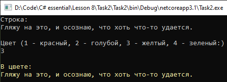

# Lesson8_task2
Условия задачки:
>Используя Visual Studio, создайте проект по шаблону Console Application. 
Создайте статический класс с методом void Print (string stroka, int color), который выводит на экран строку заданным цветом.  Используя перечисление, создайте набор цветов, доступных пользователю. Ввод строки и выбор цвета предоставьте пользователю. 

Подытог: вот такенный майндфак на выходе
>

